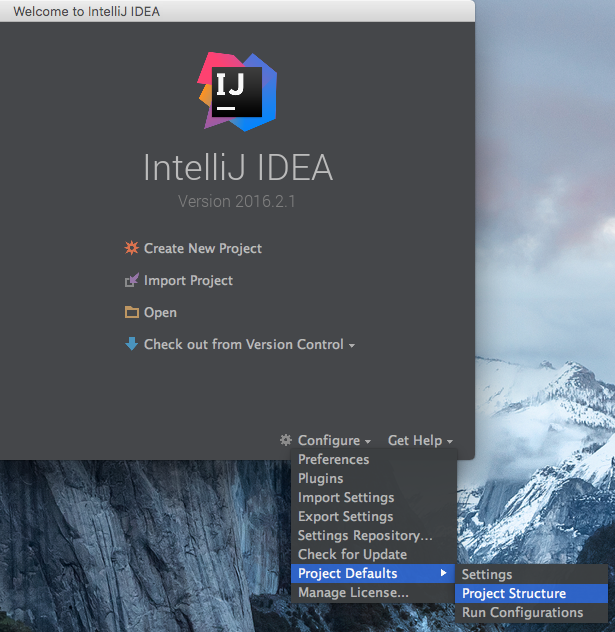
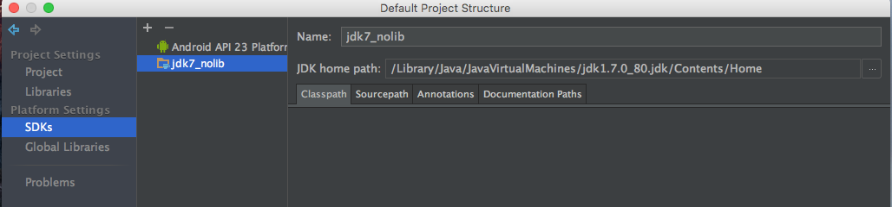
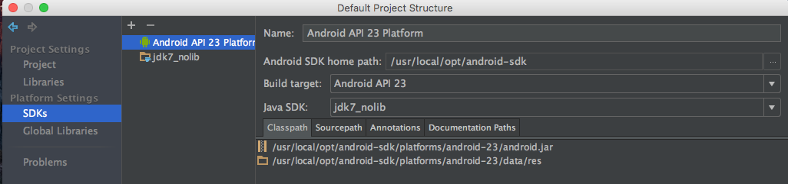
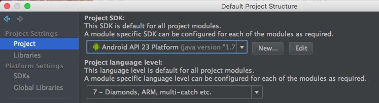
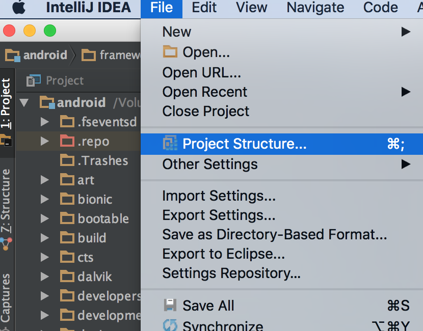
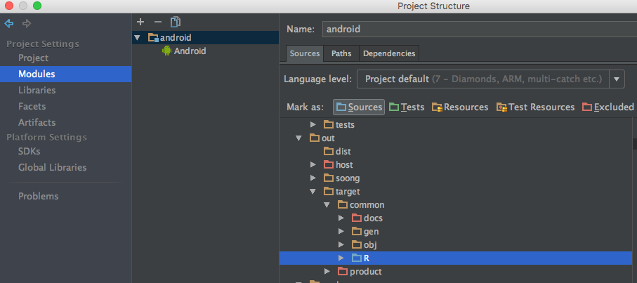
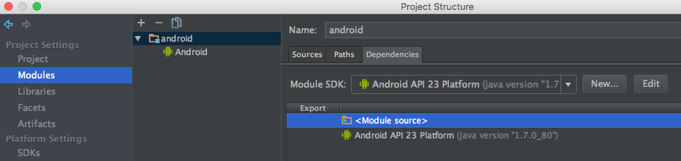

## Introduction

Although the fact that AOSP already provides IDE-level developing support, the configuration process may still confuse us. In this article, I'll give a detailed description on how to do this. Note that we need to [build the Android source](https://source.android.com/source/requirements.html) beforehand.

<!-- more -->

## IDEA Configuration

We need to configure the IDEA JVM options and platform properties before importing the source code. For specific os platform, please refer to the [official article](https://intellij-support.jetbrains.com/hc/en-us/articles/206544869-Configuring-JVM-options-and-platform-properties) . 

For example, on macOS, the JVM options configuration file is
`~/Library/Preferences/IntelliJIdea2016.2/idea.vmoptions`, increase the min and max memory like this (for speed up code parsing) :

```
# custom IntelliJ IDEA VM options
-Xms1024m
-Xmx4096m
-XX:ReservedCodeCacheSize=240m
-XX:+UseCompressedOops
```
For IDEA properties, open (or create) the file `~/Library/Preferences/IntelliJIdea2016.2/idea.properties` and increase the filesize like (otherwise IDEA won't parse the big R.java required):

```
# custom IntelliJ IDEA properties
idea.max.intellisense.filesize=15000
```

## AndroidManifest Configuration

If we want to debug the framework as app, we need to create an `AndroidManifest.xml` under the source code root directory and write the content:

```
<?xml version="1.0" encoding="utf-8"?>
<manifest xmlns:android="http://schemas.android.com/apk/res/android">
  <uses-sdk android:minSdkVersion="23" />
</manifest>
```

Now open IDEA and configure the platform settings for AOSP project.



## Platform Settings

### SDKs
  1. Configure jdk1.7 without library(remove all jars in Classpath) --- name as jdk7_nolib


  
  2. Add Android SDK Build target as Android 6.0 --- name as Android_23_jdk7_nolib
  (select above pre configured no lib jdk1.7 as Java SDK)
  


### Project Settings
1. Project
  - select above configured Android SDK (Android_23_jdk7_nolib)
  - Project language level -> 7 - Diamonds...


### Prepare Source Code
1. Under AOSP source root dir, execute command `mmm development/tools/idegen`, this will generate necessary IDE files. 
2. (Optional) Open file `development/tools/idegen/excluded-paths` to configure which sub projects you want to import, eg. if I only want to develop framework base, I will exclude any other projects by appending these lines:
```
## Only not exclude frameworks
art
bionic
bootable
bootstrap.bash
build
cts
dalvik
developers
development
device
docs
external
hardware
kernel
libcore
libnativehelper
ndk
packages
pdk
platform_testing
prebuilts
sdk
system
toolchain
tools
``` 
3. After that, type `development/tools/idegen/idegen.sh`, this will generate Android.iml and Android.ipr files in the source root dir.
4. Now you can open the Android.ipr through IDEA. After the indexing finishes, we need to configure the rest parts. Open Project Structure:


Under Modules Tab, add Android framework (or just confirm when IDEA pops up a configure Android framework hint).

5. In Source Tab, mark out/target/common/R as sources folder 
   

6. In Dependencies Tab, remove all module dependencies except two `Module source` and `Project SDK (Android_23_jdk7_nolib)`


7. (Optional but recommended) For Unregistered VCS root detected info:
 Go Preferences->Version Control->add root and apply

Now enjoy developing the Android source code!

## References  
https://android.googlesource.com/platform/development/+/master/tools/idegen/README
http://www.cnblogs.com/Lefter/p/4176991.html
https://github.com/android/platform_development/blob/master/tools/idegen/excluded-paths
https://shuhaowu.com/blog/setting_up_intellij_with_aosp_development.html
https://www.jetbrains.com/idea/help/increasing-memory-heap.html
http://stackoverflow.com/questions/27690431/configure-intellij-idea-such-that-source-detected-in-git-but-unregistered-vcs-ro/29358524#29358524

